# iDempiere 開源 ERP 學習筆記

本文件包含來自 [iDempiere 開源 ERP 系列文章](https://www.mxp.tw/category/software/idempiere/) 的學習筆記與心智圖整理。

## 📚 系列文章目錄
1. [iDempiere 開源 ERP 全解析：從 Compiere 到社群驅動的企業級商業套件](https://www.mxp.tw/11368/) ✅
2. [iDempiere vs Odoo vs ERPNext：開源 ERP 三強比較，怎麼選？](https://www.mxp.tw/11371/) ✅
3. [多租戶架構解密：Client、Organization、Role 的設計哲學](https://www.mxp.tw/11372/) ✅
4. [快速體驗：用 Docker 十分鐘跑起來（含 GardenWorld 示範資料）](https://www.mxp.tw/11373/) ✅
5. [正式環境部署：從零到上線的完整指南](https://www.mxp.tw/11374/) ✅
6. [銷售流程全走查：從報價到收款（Quote-to-Cash）](https://www.mxp.tw/11375/) ✅
7. [採購流程全走查：從請購到付款（Requisition-to-Pay）](https://www.mxp.tw/11376/) ✅
8. [庫存與物料管理：倉庫、定價與產品屬性設定](https://www.mxp.tw/11377/) ✅
9. [會計與財務報表：文件驅動會計的哲學與實踐](https://www.mxp.tw/11378/) ✅
10. [退貨處理與 Open Items 管理：RMA、帳齡分析與沖帳邏輯](https://www.mxp.tw/11379/) ✅
11. [製造模組入門：BOM、工單與生產排程](https://www.mxp.tw/11380/) ✅
12. [Workflow 引擎與商業流程自動化](https://www.mxp.tw/11381/) ✅
13. [Plugin 開發入門：用 OSGi 擴充 iDempiere 而不改核心](https://www.mxp.tw/11382/) ✅
14. [台灣在地化挑戰：統一發票、會計法規與中文化](https://www.mxp.tw/11383/) ✅
15. [導入實戰建議：從評估、規劃到上線的路線圖](https://www.mxp.tw/11384/) ✅

---

## 1. iDempiere 全解析：從 Compiere 到社群驅動的企業級商業套件
**來源:** [https://www.mxp.tw/11368/](https://www.mxp.tw/11368/)

### 🧠 心智圖 (Mind Map)

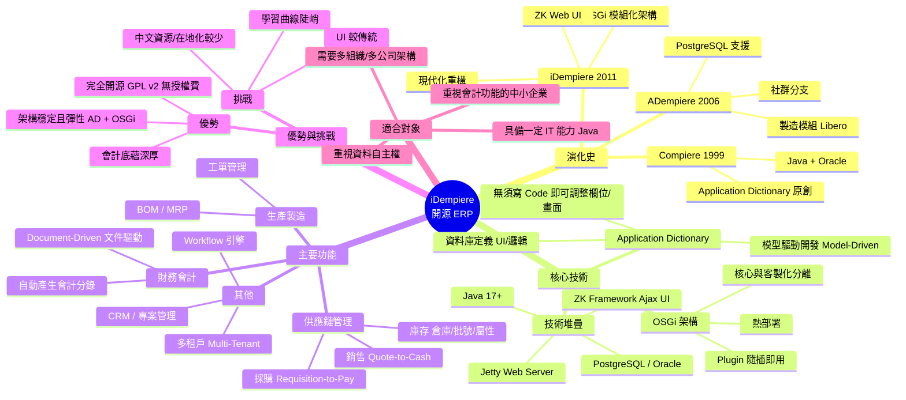

### 📝 重點筆記

#### 1. 什麼是 iDempiere？
*   **定義**：一套社群驅動、GPL v2 授權（完全免費）的企業級 ERP/CRM/SCM 套件。
*   **定位**：適合需要深度客製化、擁有 IT 能力、重視會計嚴謹性的中小企業至大型企業。

#### 2. 歷史演進三部曲
*   **Compiere (1999)**：開創者。引入「Application Dictionary (AD)」概念，將程式邏輯資料庫化。
*   **ADempiere (2006)**：因不滿 Compiere 商業化而誕生的社群分支。加入了 PostgreSQL 支援與製造模組。
*   **iDempiere (2011)**：架構革命。引入 **OSGi**，解決了舊版「客製化難以升級」的痛點，實現模組化與熱插拔。

#### 3. 兩大核心技術
1.  **Application Dictionary (AD, 應用字典)**：
    *   **Low-Code 先驅**：透過設定資料庫（Metadata）來定義視窗、欄位、驗證規則，而非寫死在程式碼中。
    *   **優點**：開發速度快、彈性高。
2.  **OSGi (Open Services Gateway initiative)**：
    *   **模組化**：核心功能與擴充套件（Plugins）完全分離。
    *   **解決痛點**：升級核心時，不會覆蓋掉客製化的 Plugin，大幅降低維護成本。

#### 4. 核心功能模組
*   **會計 (Accounting)**：核心強項。採用「文件驅動會計」，交易單據（發票、收貨單）完成時自動產生會計分錄，確保帳務即時且準確。
*   **進銷存 (SCM)**：完整的採購（請購→付款）與銷售（報價→收款）流程，以及支援多倉庫、多屬性的庫存管理。
*   **製造 (Manufacturing)**：內建 Libero 製造模組，支援 BOM、MRP 與生產排程。

#### 5. 優缺點評估
*   **🟢 優勢**：
    *   **成本**：零授權費，無「企業版」付費陷阱。
    *   **架構**：多租戶（Multi-Tenant）架構，一套系統可管多間公司。
    *   **彈性**：原始碼完全開放，可深度客製。
*   **🔴 挑戰**：
    *   **門檻**：安裝部署與學習曲線較高，不如 Odoo 親民。
    *   **在地化**：台灣在地化（發票、稅務）需自行處理或尋求廠商，中文資源相對稀缺。
    *   **UI**：ZK 介面功能強大但視覺風格較傳統。

---

## 2. iDempiere vs Odoo vs ERPNext：開源 ERP 三強比較，怎麼選？
**來源:** [https://www.mxp.tw/11371/](https://www.mxp.tw/11371/)

### 🧠 心智圖 (Mind Map)

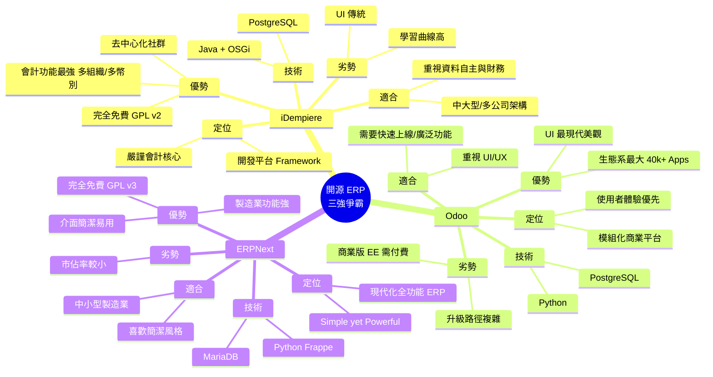

### 📝 重點筆記

#### 1. 三大系統定位與哲學
*   **iDempiere (Java)**：
    *   **哲學**：企業級會計引擎 + 開發平台。
    *   **治理**：完全社群驅動，無廠商控制。
    *   **特色**：文件驅動會計、多租戶架構。
*   **Odoo (Python)**：
    *   **哲學**：模組化商業平台，UX 優先。
    *   **治理**：商業公司 (Odoo S.A.) 主導 + 社群 (OCA)。
    *   **特色**：功能包山包海 (CRM, 電商, HR)，生態系最豐富。
*   **ERPNext (Python)**：
    *   **哲學**：Simple yet powerful，全功能且現代化。
    *   **治理**：Frappe Technologies 主導，但保持 GPL v3 完全開源。
    *   **特色**：製造業功能強，Frappe 框架開發體驗佳。

#### 2. 關鍵功能比較
| 面向 | iDempiere | Odoo | ERPNext |
| :--- | :--- | :--- | :--- |
| **會計深度** | ⭐⭐⭐⭐⭐ (最強，多帳簿/多幣別) | ⭐⭐⭐⭐ (EE 版較完整) | ⭐⭐⭐⭐ |
| **UI/UX** | 傳統 (ZK) | 最現代化 (OWL) | 簡潔清爽 |
| **製造 (BOM/MRP)** | ⭐⭐⭐⭐ (Libero) | ⭐⭐⭐⭐ | ⭐⭐⭐⭐⭐ (強項) |
| **生態系** | 小而精 | 最大 (40k+ Apps) | 中等 |
| **授權** | GPL v2 (完全免費) | LGPL (CE) / 付費 (EE) | GPL v3 (完全免費) |

#### 3. 成本結構解析
*   **iDempiere & ERPNext**：
    *   軟體授權費為 **$0**。
    *   主要成本在於「IT 人力」與「客製化開發」。
    *   iDempiere 長期持有成本最低 (無升級費、無人頭費)。
*   **Odoo**：
    *   社群版 (CE) 免費，但功能受限 (缺完整會計/行銷等)。
    *   企業版 (EE) 需按使用者付費，長期成本較高。
    *   很多企業用 CE 後發現需升級 EE 才能滿足需求。

#### 4. 選擇建議 (Decision Guide)
*   **選 iDempiere 若你...**
    *   是中大型企業，有複雜的財務/會計需求 (多公司、多幣別)。
    *   有 Java 技術團隊。
    *   極度重視資料自主，不想被廠商綁定。
*   **選 Odoo 若你...**
    *   最看重操作介面 (UI/UX)。
    *   需要電商、行銷等前端整合功能。
    *   希望有現成模組直接用，且有預算支付企業版費用。
*   **選 ERPNext 若你...**
    *   是中小型製造業。
    *   喜歡簡潔介面與 Python 開發體驗。
    *   堅持完全開源免費，但不需要 iDempiere 那麼重型的架構。

---

## 3. 多租戶架構解密：Client、Organization、Role 的設計哲學
**來源:** [https://www.mxp.tw/11372/](https://www.mxp.tw/11372/)

### 🧠 心智圖 (Mind Map)

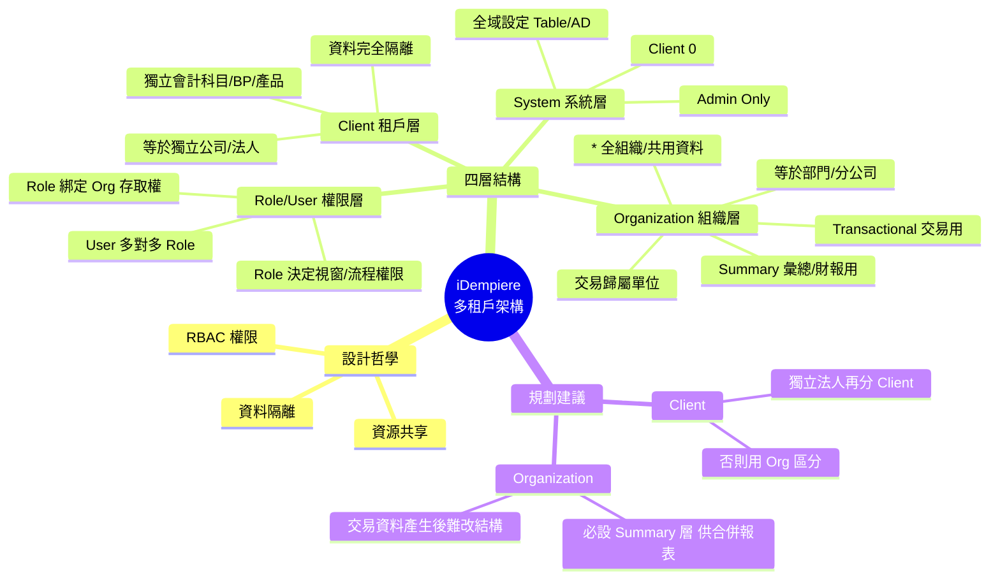

### 📝 重點筆記

#### 1. 為什麼需要多租戶 (Multi-Tenant)？
*   **目的**：讓一套 ERP 系統同時服務多個獨立公司（如集團子公司、SaaS 客戶），共用程式碼與資料庫，但資料彼此隔離。
*   **效益**：降低維運成本，同時保留各公司的獨立性。

#### 2. iDempiere 四層架構詳解
這四層架構是 iDempiere 的運作根基，權限與資料隔離皆基於此：

1.  **System (系統層, Client ID=0)**
    *   最高層級，僅供 System Admin 使用。
    *   負責定義資料庫結構、Application Dictionary (AD) 等全域設定。
    *   此層級的變更會影響所有 Client。

2.  **Client / Tenant (公司/租戶層)**
    *   **定義**：資料隔離的最高邊界，通常對應一個獨立的「法人實體」或「集團」。
    *   **隔離範圍**：擁有獨立的會計科目表 (COA)、商業夥伴 (BP)、產品、倉庫等。A Client 看不到 B Client 的資料。

3.  **Organization (組織層)**
    *   **定義**：公司內部的事業單位（分公司、部門），是財務記帳的最小單位。
    *   **分類**：
        *   **Summary (彙總組織)**：不記交易，僅用於合併報表（如：總公司）。
        *   **Transactional (交易組織)**：實際發生交易的單位（如：台北分公司）。
        *   *** (星號/全組織)**：存放該 Client 下跨部門共用的資料（如：共用的產品清單）。

4.  **Role -> User (權限層)**
    *   採 **RBAC (Role-Based Access Control)** 設計。
    *   **Role (角色)**：決定「能看到什麼 Org」、「能開什麼視窗」、「能按什麼按鈕」。
    *   **User (使用者)**：登入的人。一個 User 可擁有多個 Role，登入時需選擇身分。

#### 3. 實務規劃建議
*   **Client vs Organization**：
    *   只有在「財務與資料需要完全隔離」時才開新 Client。
    *   若是同一集團下的不同部門或分公司，應使用 Organization 區分，以便進行報表合併與資源共享。
*   **Organization 結構**：
    *   務必規劃 **Summary Org** 層級，否則未來做集團合併報表會很痛苦。
    *   結構一經交易確認後難以修改，初期規劃需謹慎。

---

## 4. 快速體驗：用 Docker 十分鐘跑起來（含 GardenWorld 示範資料）
**來源:** [https://www.mxp.tw/11373/](https://www.mxp.tw/11373/)

### 🧠 心智圖 (Mind Map)

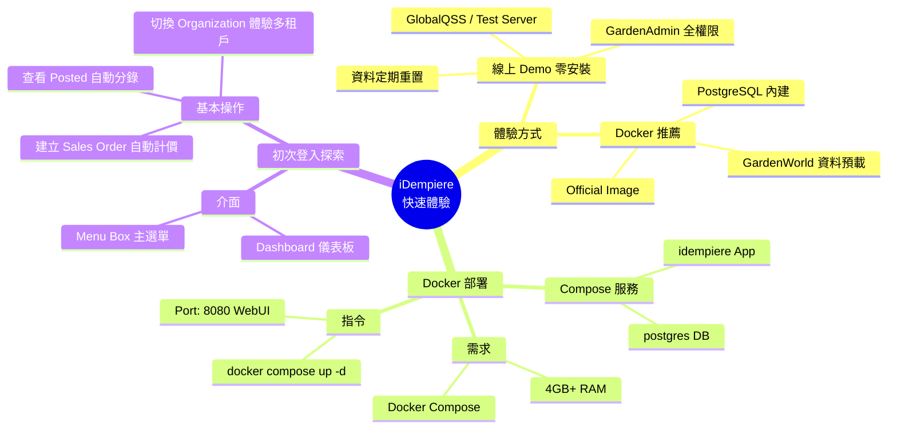

### 📝 重點筆記

#### 1. 兩種體驗方式
*   **線上 Demo**：適合「只看不練」。
    *   連結：[GlobalQSS Demo](https://demo.globalqss.com/webui/) 或 [Test Server](https://test.idempiere.org/webui/)
    *   帳號：`GardenAdmin` / `GardenAdmin`
*   **Docker 部署**（推薦）：適合「動手操作」。
    *   官方 Image：`idempiereofficial/idempiere:12`
    *   特色：內建 GardenWorld 示範資料，開箱即用。

#### 2. Docker 快速啟動
*   建立 `docker-compose.yml` (含 App 與 DB 服務)。
*   執行 `docker compose up -d`。
*   存取：`http://localhost:8080/webui/`。
*   **注意**：首次啟動需等待 DB 初始化 (約 3-5 分鐘)。

#### 3. 登入後必看重點
*   **Menu Box**：熟悉功能樹狀結構 (Quote-to-Invoice, Material Management 等)。
*   **文件驅動會計 (Document-Driven Accounting)**：
    *   試著建立一張 **Sales Order** 並完成它。
    *   觀察 **Posted** 按鈕，點擊放大鏡查看系統「自動產生」的會計分錄 (Accounting Fact)。
*   **多租戶體驗**：
    *   右上角切換 **Organization** (如：HQ -> Store Central)，觀察資料可見範圍的變化。

---

## 5. 正式環境部署：從零到上線的完整指南
**來源:** [https://www.mxp.tw/11374/](https://www.mxp.tw/11374/)

### 🧠 心智圖 (Mind Map)

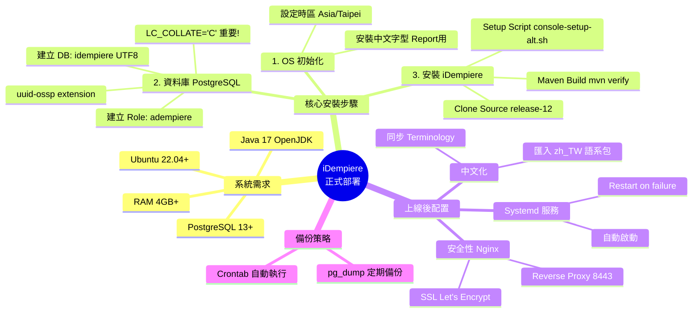

### 📝 重點筆記

#### 1. 系統需求與環境準備
*   **OS**: Ubuntu 22.04+ / Debian 12+。
*   **DB**: PostgreSQL 13+ (建議 17)。
*   **Java**: OpenJDK 17 (建議用 SDKMAN 安裝)。
*   **關鍵設定**：
    *   **時區**：務必設為 `Asia/Taipei`，否則交易時間會錯亂。
    *   **字型**：安裝 `fonts-noto-cjk` 等中文字型，確保 PDF 報表中文不亂碼。

#### 2. 資料庫安裝眉角 (PostgreSQL)
*   **Locale 設定**：建立 DB 時必須指定 `LC_COLLATE='C'` 與 `LC_CTYPE='C'`，這是 iDempiere 的強制要求，確保排序一致性。
*   **Extension**：啟用 `uuid-ossp`。
*   **安全性**：將 `pg_hba.conf` 的驗證方式改為 `scram-sha-256`。

#### 3. 安裝與編譯
*   推薦從 **Source Code** 編譯安裝 (GitHub `release-12` 分支)，以便日後整合客製化 Plugin。
*   編譯指令：`mvn verify -U`。
*   初始化指令：`./console-setup-alt.sh` (設定 DB 連線) -> `./RUN_ImportIdempiere.sh` (匯入種子資料)。

#### 4. 上線最後一哩路
*   **Service**: 建立 systemd service 檔，確保開機自動啟動。
*   **Proxy**: 使用 Nginx 反向代理，配合 Certbot 取得免費 SSL 憑證 (Let's Encrypt)。
*   **中文化**: 登入 System Client，匯入 `zh_TW` 語系包並執行同步。
*   **備份**: 設定 Crontab 每日執行 `pg_dump`。

---

## 6. 銷售流程全走查：從報價到收款 (Quote-to-Cash)
**來源:** [https://www.mxp.tw/11375/](https://www.mxp.tw/11375/)

### 🧠 心智圖 (Mind Map)

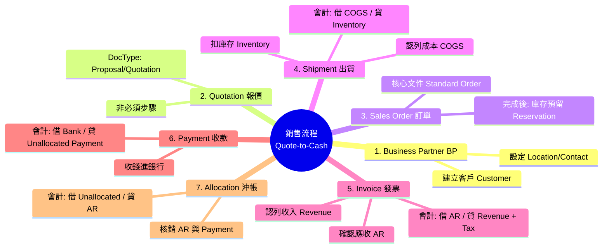

### 📝 重點筆記

#### 1. 流程總覽：Quote-to-Cash (Q2C)
這是 ERP 最核心的循環之一，iDempiere 透過「文件驅動 (Document-Driven)」自動產生所有會計分錄。
*   **流程**：客戶 (BP) → 報價 (Quotation) → 訂單 (Order) → 出貨 (Shipment) → 發票 (Invoice) → 收款 (Payment) → 沖帳 (Allocation)

#### 2. 關鍵步驟與會計影響
每個步驟完成 (Complete/Post) 後，系統會在背景自動寫入會計帳 (Fact_Acct)：

| 步驟 | 文件 (Document) | 會計分錄 (Accounting Entry) | 意義 |
| :--- | :--- | :--- | :--- |
| **出貨** | Material Shipment | 借：銷貨成本 (COGS) 貸：庫存資產 (Inventory) | 庫存減少，成本認列 |
| **發票** | Sales Invoice | 借：應收帳款 (AR) 貸：銷貨收入 (Revenue) + 銷項稅額 | 確認債權，收入認列 |
| **收款** | Payment | 借：銀行存款 (Bank) 貸：未分配款項 (Unallocated) | 現金入帳，但尚未指定沖哪筆帳 |
| **沖帳** | Allocation | 借：未分配款項 (Unallocated) 貸：應收帳款 (AR) | 將收款與發票對應，消除應收帳款 |

#### 3. 實務操作重點
*   **Business Partner (BP)**：客戶與供應商都共用此視窗，記得勾選 `Customer`。
*   **Quotation**：非必須，可直接開 Order。若從 Quote 開始，可直接轉單。
*   **Payment Allocation**：這是新手最容易漏掉的步驟！收了錢 (Payment) 若不做沖帳 (Allocation)，應收帳款 (AR) 會一直掛著，帳齡分析會是錯的。

---

## 7. 採購流程全走查：從請購到付款 (Requisition-to-Pay)
**來源:** [https://www.mxp.tw/11376/](https://www.mxp.tw/11376/)

### 🧠 心智圖 (Mind Map)

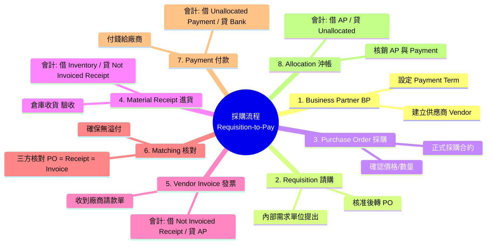

### 📝 重點筆記

#### 1. 流程總覽：Requisition-to-Pay
採購是銷售的鏡像流程，但多了一個重要的「三方核對 (Matching)」機制。
*   **流程**：供應商 (Vendor) → 請購 (Requisition) → 採購 (PO) → 進貨 (Receipt) → 供應商發票 (Invoice) → 核對 (Matching) → 付款 (Payment) → 沖帳 (Allocation)

#### 2. 關鍵步驟與會計影響
採購端的會計分錄展現了「暫估負債」的概念：

| 步驟 | 文件 (Document) | 會計分錄 (Accounting Entry) | 意義 |
| :--- | :--- | :--- | :--- |
| **進貨** | Material Receipt | 借：庫存資產 (Inventory) 貸：**未開票驗收 (Not Invoiced Receipt)** | 貨到了但發票沒到，先認列暫估負債 |
| **發票** | Vendor Invoice | 借：**未開票驗收** + 進項稅額 貸：應付帳款 (AP) | 發票到了，沖銷暫估負債，轉為正式應付帳款 |
| **付款** | Payment | 借：未分配付款 (Unallocated) 貸：銀行存款 (Bank) | 現金流出 |
| **沖帳** | Allocation | 借：應付帳款 (AP) 貸：未分配付款 (Unallocated) | 消除應付帳款 |

#### 3. 實務操作重點
*   **Requisition (請購單)**：這是內部流程（例如 RD 部門想買電腦），不一定要有，但大型企業通常會有嚴謹的簽核。
*   **Not Invoiced Receipt (NIR)**：這是一個重要的中介科目。如果月底結帳時這個科目有餘額，代表「貨到了發票還沒來」，這在會計上非常重要。
*   **Matching (三方核對)**：iDempiere 系統會自動檢查 PO 數量、Receipt 數量與 Invoice 數量是否一致，防止廠商多開法票或倉庫少收貨。

---

## 8. 庫存與物料管理：倉庫、定價與產品屬性設定
**來源:** [https://www.mxp.tw/11377/](https://www.mxp.tw/11377/)

### 🧠 心智圖 (Mind Map)

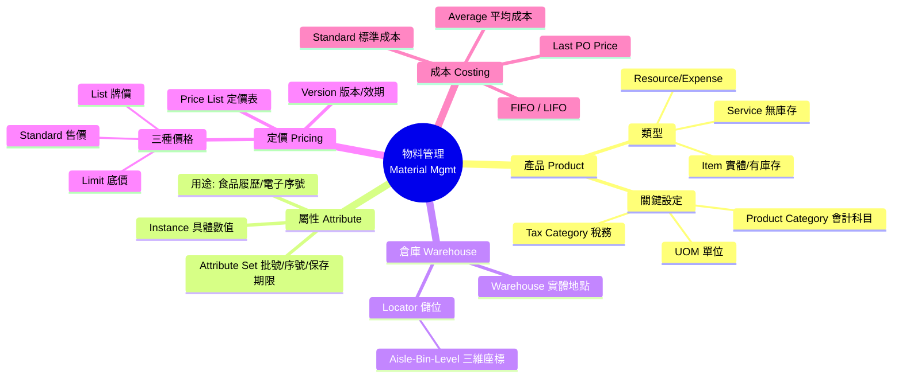

### 📝 重點筆記

#### 1. 產品主檔 (Product)
*   **類型 (Product Type)**：
    *   **Item**：實體商品，會追蹤庫存。
    *   **Service**：服務，無庫存，但可開立發票。
*   **分類 (Category)**：這不只是分類，還決定了預設的**會計科目** (如：存貨科目、銷貨成本科目)。

#### 2. 產品屬性 (Attribute Set)
*   這是 iDempiere 強大的地方，可以針對不同產品設定追蹤需求：
    *   **批號 (Lot)**：食品、藥品管理。
    *   **序號 (Serial No)**：3C 產品、機械設備。
    *   **有效日期 (Guarantee Date)**：過期管理。
*   屬性集 (Attribute Set) 設定後，每次進出貨系統都會強制要求輸入對應資訊。

#### 3. 倉庫結構 (Warehouse Structure)
*   **兩層式架構**：
    *   **Warehouse**：大倉庫 (如：台北倉、高雄倉)。綁定於 Organization。
    *   **Locator**：倉庫內的具體儲位 (如：A排-3架-2層)。
*   進出貨時一定要指定 Locator，方便撿貨與盤點。

#### 4. 定價策略 (Price List)
*   **結構**：Price List → Version (有效期) → Product Price。
*   **三種價格**：
    *   **List Price**：建議售價 (牌價)。
    *   **Standard Price**：實際成交價。
    *   **Limit Price**：業務員能給的最低底價 (低於此價系統會擋)。

---

## 9. 會計與財務報表：文件驅動會計的哲學與實踐
**來源:** [https://www.mxp.tw/11378/](https://www.mxp.tw/11378/)

### 🧠 心智圖 (Mind Map)

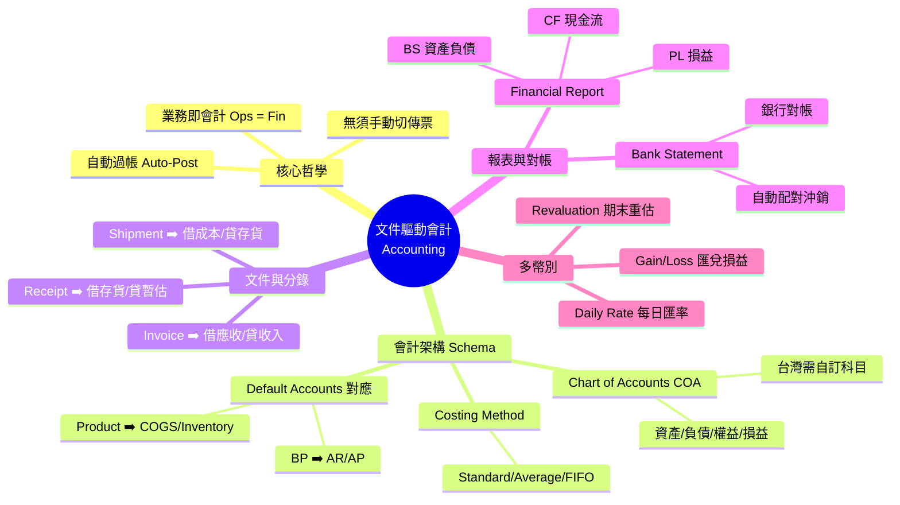

### 📝 重點筆記

#### 1. 核心哲學：文件驅動會計 (Document-Driven Accounting)
iDempiere 與傳統軟體最大的不同：**業務與會計不分家**。
*   每當一個業務文件 (Order, Shipment, Invoice) 被「完成 (Complete)」時，系統會立即在背景產生對應的會計分錄。
*   **好處**：即時、準確、可追溯 (從分錄點回去就能看到是哪張發票產生的)。

#### 2. 會計設定三支柱
要讓系統自動做帳，必須先設定好規則：
*   **Accounting Schema**：定義主幣別、成本計算方式。
*   **Chart of Accounts (COA)**：會計科目表。台灣使用者通常需要依照「商業會計法」自行建立一套中文科目。
*   **Default Accounts (預設科目對應)**：這是最關鍵的橋樑。你必須告訴系統：「出貨」這個動作，借方要塞哪個科目 (銷貨成本)，貸方要塞哪個科目 (存貨)。

#### 3. 財務報表與多幣別
*   **Financial Report**：系統內建報表產生器，可產出 BS、PL、Trial Balance 等標準報表，並支援鑽取 (Drill-down) 到明細。
*   **多幣別 (Multi-Currency)**：支援每日匯率更新、期末匯率重估 (Revaluation)，系統會自動計算匯兌損益 (Gain/Loss)，這對於跨國貿易公司非常實用。

#### 4. 銀行對帳 (Bank Statement)
*   除了自動產生的分錄，iDempiere 也提供銀行對帳功能。
*   匯入銀行對帳單 (Statement) 後，系統會嘗試自動與系統內的收付款 (Payment) 進行配對 (Matching)，節省會計人員月底對帳的時間。

---

## 10. 退貨處理與 Open Items 管理：RMA、帳齡分析與沖帳邏輯
**來源:** [https://www.mxp.tw/11379/](https://www.mxp.tw/11379/)

### 🧠 心智圖 (Mind Map)

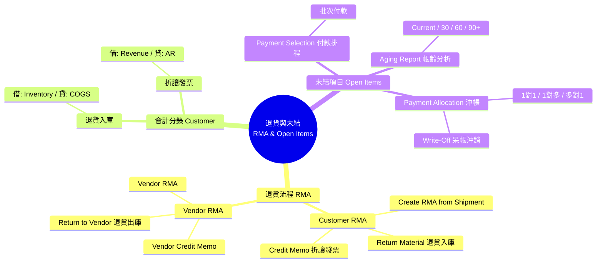

### 📝 重點筆記

#### 1. 退貨標準作業 (RMA Process)
退貨不只是把貨拿回來，還有錢要退，流程是銷售的「倒帶」：
1.  **RMA (退貨授權)**：先開單確認要退什麼。
2.  **Customer Return (退貨入庫)**：貨回到倉庫，庫存增加，同時沖銷銷貨成本 (COGS)。
3.  **Credit Memo (折讓發票)**：開立折讓單給客戶，沖減應收帳款 (AR) 與銷貨收入 (Revenue)。

#### 2. Open Items (未結項目) 管理
這塊是財務人員最常用的功能，用來盯緊現金流：
*   **Aging Report (帳齡分析)**：一鍵拉出誰欠錢欠多久了 (0-30天, 30-60天...)，是催收的依據。
*   **Payment Allocation (沖帳)**：把「收到的錢」跟「發票」連連看。
    *   **Write-Off (呆帳)**：如果客戶真的不付了，可以在沖帳時直接選 Write-Off，系統會自動認列呆帳損失。
*   **Payment Selection**：要付錢給廠商時，可以用這個功能批次撈出「到期該付」的帳單，一次產生付款單。

---

## 11. 製造模組入門：BOM、工單與生產排程
**來源:** [https://www.mxp.tw/11380/](https://www.mxp.tw/11380/)

### 🧠 心智圖 (Mind Map)

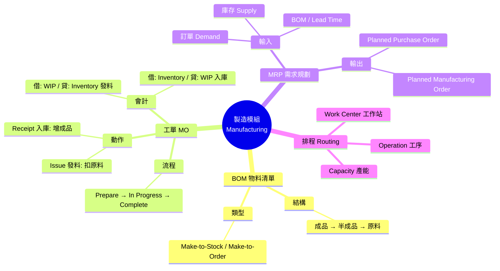

### 📝 重點筆記

#### 1. Libero Manufacturing 模組
iDempiere 內建的製造模組，功能相當完整，涵蓋：
*   **BOM (物料清單)**：定義產品結構。支援多層次 (Multi-Level) BOM。
*   **Routing (工藝路線)**：定義產品要經過哪些工作站 (Work Center) 和工序 (Operation)。
*   **MRP (物料需求規劃)**：計算「何時」需要「多少」原料。

#### 2. 製造工單 (Manufacturing Order, MO)
*   **生命週期**：Draft (草稿) → In Progress (生產中) → Completed (完工) → Closed (結案)。
*   **關鍵動作**：
    *   **Component Issue (發料)**：把原料從倉庫扣掉，轉入 **WIP (在製品)** 科目。
    *   **Material Receipt (完工入庫)**：把做好的成品入庫，從 **WIP** 轉入 **Inventory (存貨)** 科目。

#### 3. MRP 的威力
*   MRP 會幫你算數學：根據手上的訂單 (Demand)、現有的庫存 (Supply) 和採購/生產的前置時間 (Lead Time)，自動建議你：
    *   **什麼時候該買原料？** (產生 Planned Purchase Order)
    *   **什麼時候該開工單？** (產生 Planned Manufacturing Order)
*   這能大幅減少「缺料」導致停工，或「庫存過多」積壓資金的問題。

---

## 12. Workflow 引擎與商業流程自動化
**來源:** [https://www.mxp.tw/11381/](https://www.mxp.tw/11381/)

### 🧠 心智圖 (Mind Map)

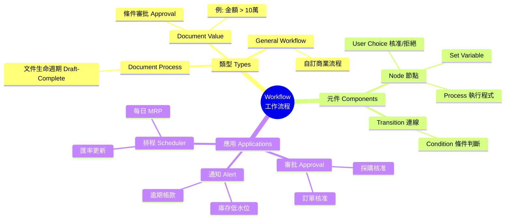

### 📝 重點筆記

#### 1. 內建 Workflow Engine (WfMC 標準)
iDempiere 的 Workflow 不只是「簽核」，它能控制系統的所有流程：
*   **Document Process**：這是底層邏輯，定義單據怎麼從「草稿」變成「完成」。
*   **Document Value (審批)**：這是最常用的。例如設定「採購金額 > 10,000 元需主管核准」。
*   **General Workflow**：可以自訂任何流程，例如「新客戶建立後自動寄送歡迎信」。

#### 2. 審批流程設定 (Approval)
*   **Role & Supervisor**：利用角色層級定義誰是誰的主管。
*   **Condition**：設定觸發條件 (如：`GrandTotal > 10000`)。
*   **User Choice**：設定審批者的選項 (Approve/Reject)。若 Reject，流程可以退回或通知申請人。

#### 3. 自動化 (Automation)
*   **Alert (警報)**：主動偵測異常。例如：寫一個 SQL 撈出「庫存 < 安全存量」的產品，系統會自動發信通知採購。
*   **Scheduler (排程)**：定期執行任務。例如：每天凌晨 2 點自動跑 MRP，早上來上班就有建議採購單可以看了。

---

## 13. Plugin 開發入門：用 OSGi 擴充 iDempiere 而不改核心
**來源:** [https://www.mxp.tw/11382/](https://www.mxp.tw/11382/)

### 🧠 心智圖 (Mind Map)

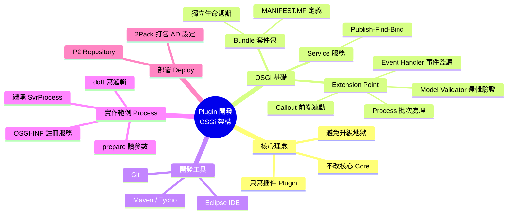

### 📝 重點筆記

#### 1. 為什麼要用 Plugin？
*   **避免「升級地獄」**：以前改 Open Source 都是直接改核心原始碼 (Core Source)，導致官方一升級，你的客製化就蓋掉了。
*   **OSGi 架構**：iDempiere 透過 OSGi 讓你的客製化程式碼變成獨立的 **Bundle (Plugin)**。核心升級時，你的 Plugin 依然健在，隨插即用。

#### 2. 常見的擴充點 (Extension Points)
iDempiere 預留了很多「插座」讓 Plugin 插進去：
*   **Model Validator**：最常用。類似 Database Trigger，在資料存檔前/後執行檢查或運算 (例如：檢查訂單金額是否為負)。
*   **Callout**：類似前端 JavaScript 事件，當使用者改變 A 欄位時，自動計算 B 欄位 (例如：選了產品，自動帶出價格)。
*   **Process**：自訂的 Java 程式，用來跑複雜運算或報表。

#### 3. 開發與部署
*   **工具**：Eclipse IDE 是標準配備，因為 iDempiere 本身就是 Eclipse Plugin 開發模式。
*   **2Pack**：這是一個很重要的工具。你的 Plugin 除了 Java Code，通常還包含資料庫設定 (如新開的視窗、欄位)。2Pack 可以把這些設定打包成 XML，方便部署到正式環境。

---

## 14. 台灣在地化挑戰：統一發票、會計法規與中文化
**來源:** [https://www.mxp.tw/11383/](https://www.mxp.tw/11383/)

### 🧠 心智圖 (Mind Map)

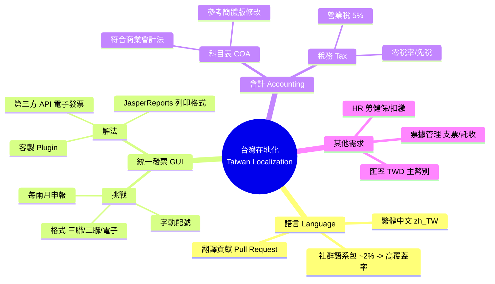

### 📝 重點筆記

#### 1. 繁體中文語系 (zh_TW)
*   **現況**：官方預設安裝幾乎是英文。
*   **解法**：務必安裝社群維護的 **繁體中文語系包** (GitHub: iDempiere-language-zh_TW)。這是導入台灣的第一步。

#### 2. 統一發票 (GUI) 挑戰
這是 iDempiere 在台灣落地的最大門檻：
*   **字軌管理**：需客製功能來管理每期配發的發票字軌。
*   **列印格式**：需調整 JasperReports 報表以符合財政部規定的發票格式 (電子計算機發票/電子發票證明聯)。
*   **電子發票**：建議透過 API 串接第三方加值中心 (如綠界、關貿)，避免自己處理複雜的 XML 簽章與上傳。

#### 3. 會計在地化
*   **會計科目表 (COA)**：預設的國際版科目不適用台灣。建議參考「商業會計法」的標準科目表重新建立。
*   **稅務**：設定 5% 營業稅 (VAT) 是基本，還要注意零稅率 (出口) 與免稅 (生鮮/土地) 的設定區隔，以免申報時混淆。
*   **票據**：台灣特有的「應收/應付票據 (Post-dated Check)」管理，iDempiere 有部分支援，但託收流程可能需微調。

---

## 15. 導入實戰建議：從評估、規劃到上線的路線圖
**來源:** [https://www.mxp.tw/11384/](https://www.mxp.tw/11384/)

### 🧠 心智圖 (Mind Map)

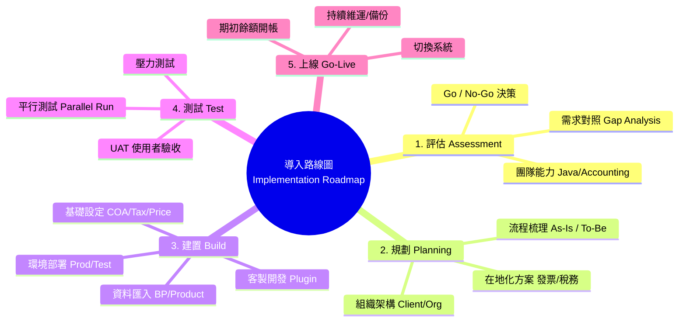

### 📝 重點筆記

#### 1. 導入五階段
*   **評估 (1-2週)**：別急著裝，先看適不適合。沒有 Java 人力？沒有會計 sense？那可能要找顧問。
*   **規劃 (2-4週)**：這階段最重要。Client/Org 架構一旦定下去，以後要改比登天還難。流程要先畫出來，不要邊做邊想。
*   **建置 (4-8週)**：安裝系統、匯入資料、寫 Plugin。記得把測試環境 (Test) 和正式環境 (Prod) 分開。
*   **測試 (2-4週)**：UAT 一定要讓實際使用者去按，不要只讓 IT 自己測。最好能做「平行測試」，新舊系統一起跑一個月，比對帳目。
*   **上線 (Go-Live)**：選一個月初或季初切換。上線前要把期初餘額 (庫存、銀行、AR/AP) 算準匯入。

#### 2. 常見踩坑經驗 (Lessons Learned)
*   **低估會計難度**：很多 IT 人員以為 ERP 只是軟體，結果卡死在借貸法則和會計科目設定上。一定要找懂會計的人一起參與。
*   **過度客製化**：能用原生流程就盡量用，客製化越多，未來維護成本越高 (Technical Debt)。
*   **資料品質**：匯入的資料如果是垃圾 (重複客戶、錯誤料號)，跑出來的報表也是垃圾 (GIGO)。

#### 3. 結語
iDempiere 是一套「重劍無鋒，大巧不工」的系統。它沒有最華麗的介面，但有最紮實的底層架構 (OSGi, AD, Accounting)。只要能跨過學習門檻，它會是企業最忠實的數位骨幹。
