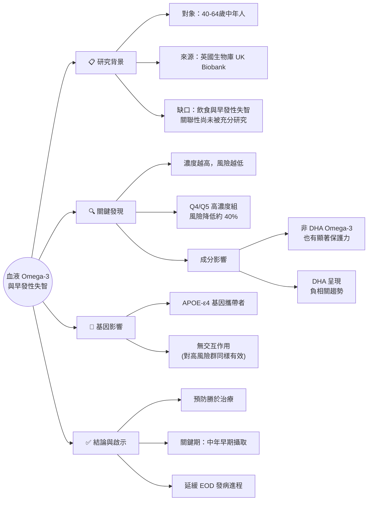

# 🩸 血液 Omega-3 與早發性失智症 (EOD) 之關聯

**來源：** [PubMed: 41506004](https://pubmed.ncbi.nlm.nih.gov/41506004/)
**作者：** Aleix Sala-Vila et al.
**期刊：** Clinical Nutrition (2026 Feb)

## 🧠 學習心智圖

## 📝 重點筆記

### 1. 核心主題
**血液中較高的 Omega-3 脂肪酸濃度，與降低「早發性失智症」(Early-Onset Dementia, EOD) 的風險呈現顯著相關。**

### 2. 背景與脈絡 (Context)
*   **早發性失智症 (EOD)：** 指 65 歲以前發病。雖然比晚發性少見，但對家庭與社會經濟負擔極大。
*   **研究缺口：** 過去 Omega-3 研究多集中在 65 歲以上的老年人 (LOD)，針對中年族群與 EOD 的飲食預防研究較少。
*   **指標優勢：** 使用「血液濃度」而非問卷，能更客觀反映實際攝取量與代謝狀況。

### 3. 研究方法 (Methodology)
*   **資料來源：** 英國生物庫 (UK Biobank)。
*   **樣本數：** 217,122 位參與者（40-64 歲，起始時無失智）。
*   **追蹤時間：** 平均 8.3 年（期間出現 325 例 EOD）。
*   **觀察指標：** 總 Omega-3、DHA、非 DHA Omega-3（分為五個等級 Q1-Q5 進行比較）。

### 4. 關鍵發現 (Key Findings)
*   **保護效果顯著：**
    *   與濃度最低組 (Q1) 相比，濃度較高組 (Q4, Q5) 的 EOD 風險顯著降低。
    *   **風險比 (Hazard Ratio)：** Q4 為 0.62，Q5 為 0.60 (即風險降低約 40%)。
*   **成分分析：**
    *   不只是 DHA，**非 DHA 的 Omega-3** (如 EPA, ALA 等) 在 Q3-Q5 組別中也顯示出顯著的保護作用。
*   **基因無交互作用：**
    *   無論是否攜帶阿茲海默症高風險基因 (APOE-ε4)，Omega-3 的保護效果都存在。這意味著**高遺傳風險族群也能透過飲食受益**。

### 5. 結論與啟示 (Conclusion)
*   **擴展認知：** Omega-3 的腦部保護作用不僅限於老年，對**中年人**預防早發性失智同樣重要。
*   **行動建議：** 在生命早期（中年）就開始增加 Omega-3 攝取（如深海魚油、亞麻籽等），可能有助於延緩或預防 EOD 的發生。

---
*整理自 PubMed 41506004，由 OpenClaw 生成*
